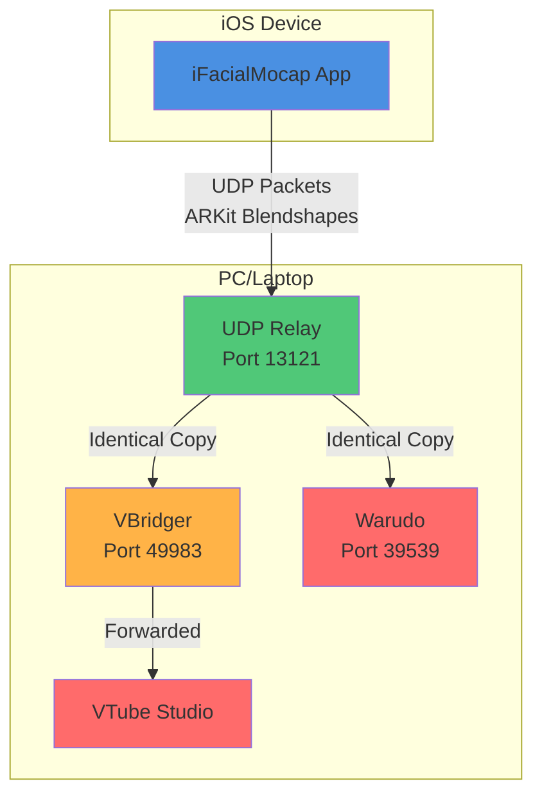
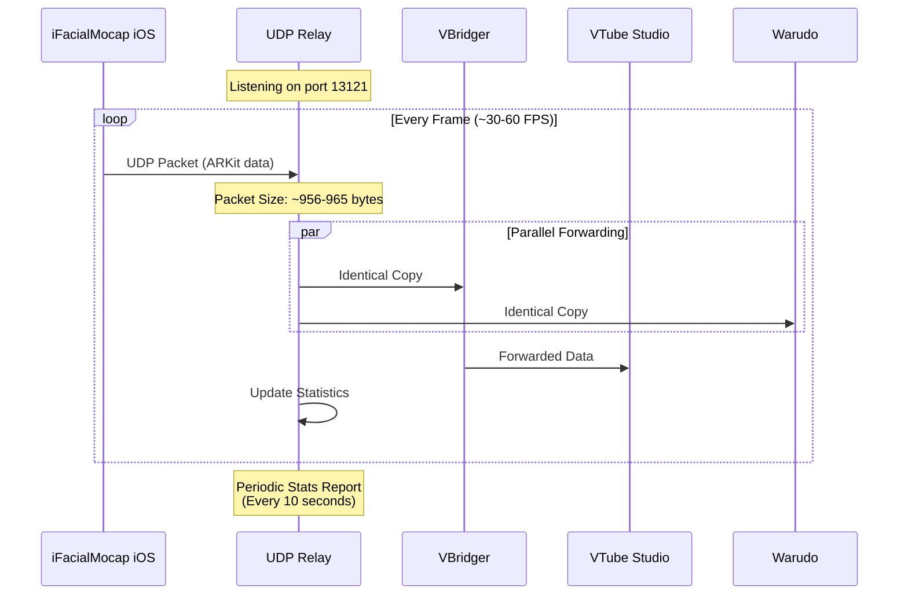

# iFacialMocap UDP Relay

A lightweight Go-based UDP relay that receives ARKit-style facial tracking data from the iFacialMocap iOS app and forwards it simultaneously to multiple destinations (VBridger for VTube Studio, Warudo, etc.) without introducing measurable latency.

## Overview

The relay forwards packets byte-for-byte to all configured targets without modification. This enables splitting iFacialMocap's single UDP stream to multiple applications simultaneously, allowing you to use the same facial tracking data in multiple programs at once.

## Architecture



## Traffic Flow



## Data Format

Based on packet analysis, iFacialMocap sends ARKit-compatible facial tracking data in a pipe-separated string format:

### Packet Structure

- **Packet Size**: ~956-965 bytes
- **Format**: Plain text, pipe-delimited
- **Protocol**: UDP

### Data Components

1. **Blendshape Parameters** (ARKit-compatible)
   - Eye tracking: `eyeSquint_R&10`, `eyeBlink_L&26`, `eyeLookUp_L&0`
   - Mouth tracking: `mouthSmile_R&7`, `mouthPucker&9`, `mouthClose&2`
   - Brow tracking: `browDown_R&10`, `browInnerUp&8`
   - Cheek tracking: `cheekSquint_L&7`, `cheekPuff&4`
   - Jaw tracking: `jawOpen&2`, `jawForward&2`
   - Tracking status: `trackingStatus&1`

2. **Head Rotation** (6-DOF)
   - Format: `head#x,y,z,rx,ry,rz`
   - Example: `head#6.4057,-0.086789705,0.20101094,0.016818939,-0.0029828981,-0.030570496`

3. **Eye Tracking** (3-DOF per eye)
   - Format: `rightEye#x,y,z` and `leftEye#x,y,z`
   - Example: `rightEye#1.4575024,-0.26850903,-0.016194224`

### Example Packet Content

```
trackingStatus&1|eyeSquint_R&10|eyeBlink_L&26|mouthSmile_L&5|...
=head#6.4057,-0.086789705,0.20101094,0.016818939,-0.0029828981,-0.030570496|
rightEye#1.4575024,-0.26850903,-0.016194224|
leftEye#1.4462843,-0.30282283,-0.123135895|
```

## Installation & Build

This relay is primarily designed for Windows. It can also be built on macOS/Linux for experimental purposes.

### Prerequisites

Install Go 1.22 or later:

#### Windows (Primary Platform)

**Option 1: Using winget (Recommended)**
```cmd
winget install GoLang.Go
```

**Option 2: Manual Installation**
1. Download Go from https://go.dev/dl/
2. Run the installer (.msi file)
3. The installer will add Go to your PATH automatically
4. Verify installation: Open a new Command Prompt or PowerShell and run:
   ```cmd
   go version
   ```

**Option 3: Using Chocolatey**
```cmd
choco install golang
```

#### macOS (Experimental/Development)

```bash
brew install go
```

**Note**: While the relay can be built on macOS, it's primarily designed and tested for Windows. Use macOS for development/experimentation purposes.

#### Linux (Experimental/Development)

Use your distribution's package manager:
```bash
# Debian/Ubuntu
sudo apt-get install golang-go

# Fedora/RHEL
sudo dnf install golang

# Arch Linux
sudo pacman -S go
```

### Build Instructions

#### Windows Build

```cmd
# Standard build
go build -ldflags "-s -w" -o ifmrelay.exe main.go

# Smallest binary size (recommended)
go build -ldflags "-s -w" -trimpath -o ifmrelay.exe main.go
```

**Build Flags Explained:**
- `-ldflags "-s -w"`: Strips debug symbols and reduces binary size
- `-trimpath`: Removes file system paths from the compiled binary
- `-o ifmrelay.exe`: Output filename

#### macOS/Linux Build (Experimental)

```bash
# Standard build
go build -ldflags "-s -w" -o ifmrelay main.go

# Smallest binary size
go build -ldflags "-s -w" -trimpath -o ifmrelay main.go
```

### Post-Build Setup

Place the compiled binary (`ifmrelay.exe` on Windows, `ifmrelay` on macOS/Linux) and `relay_config.json` in the same directory.

## Usage

1. **Edit Configuration**
   
   Edit `relay_config.json` to match your setup:
   ```json
   {
     "listen_port": 13121,
     "targets": [
       {"host": "127.0.0.1", "port": 49983, "name": "VBridger"},
       {"host": "127.0.0.1", "port": 39539, "name": "Warudo"}
     ],
     "buffer_size": 4096,
     "log_level": "info",
     "stats_interval": 10
   }
   ```
   
   **Note**: Port `13121` is a custom port chosen to avoid conflicts with common software. It maps to Celeste themes/motifs and should not interfere with well-known services.

2. **Start the Relay**
   
   ```bash
   .\ifmrelay.exe -config relay_config.json
   ```

3. **Configure iFacialMocap iOS App**
   - Set your PC's IP address
   - Set port to `13121` (or your configured `listen_port`)
   - **IMPORTANT**: After starting the relay, restart iFacialMocap to establish connection

4. **Configure Windows Firewall** (Windows only)
   
   Windows Defender Firewall will likely block incoming UDP traffic. You need to allow the relay:
   
   **Option A: Allow via Windows Defender Firewall GUI**
   1. Open Windows Defender Firewall: `Win + R`, type `wf.msc`, press Enter
   2. Click "Inbound Rules" → "New Rule..."
   3. Select "Port" → Next
   4. Select "UDP" and enter port `13121` → Next
   5. Select "Allow the connection" → Next
   6. Check all profiles (Domain, Private, Public) → Next
   7. Name it "iFacialMocap UDP Relay" → Finish
   
   **Option B: Allow via PowerShell (Run as Administrator)**
   ```powershell
   New-NetFirewallRule -DisplayName "iFacialMocap UDP Relay" -Direction Inbound -Protocol UDP -LocalPort 13121 -Action Allow
   ```
   
   **Option C: Allow the executable directly**
   1. Open Windows Defender Firewall: `Win + R`, type `wf.msc`, press Enter
   2. Click "Inbound Rules" → "New Rule..."
   3. Select "Program" → Next
   4. Browse to `ifmrelay.exe` → Next
   5. Select "Allow the connection" → Next
   6. Check all profiles → Next
   7. Name it "iFacialMocap UDP Relay" → Finish

5. **Verify**
   
   VBridger (which forwards to VTube Studio) and Warudo should receive tracking data simultaneously.

## Verification

When started correctly, you should see:

```
[INFO] Listening on :13121
[INFO] Forwarding to 127.0.0.1:49983 (VBridger)
[INFO] Forwarding to 127.0.0.1:39539 (Warudo)
[INFO] Relay started successfully
```

Every 10 seconds (default), statistics will be printed:

```
[STATS] Uptime: 1m30s | Received: 450 | Forwarded: 900 | Dropped: 0 | Avg Latency: 0.123 ms
```

## Configuration Options

| Option | Type | Default | Description |
|--------|------|---------|-------------|
| `listen_port` | int | 13121 | UDP port to listen for iFacialMocap data (custom port, Celeste-themed, avoids conflicts) |
| `targets` | array | required | List of forwarding destinations |
| `buffer_size` | int | 4096 | Buffer size in bytes for packet handling |
| `log_level` | string | "info" | Logging level: `debug`, `info`, or `error` |
| `stats_interval` | int | 10 | Seconds between statistics reports |

### Target Configuration

Each target requires:
- `host`: IP address or hostname
- `port`: UDP port number
- `name`: Friendly name for logging

## Troubleshooting

### Symptom: No packets arriving or blendshapes not working

**Cause**: iFacialMocap needs to be restarted after relay starts, or wrong port/firewall

**Fix**:
- **RESTART iFacialMocap** after starting the relay (it needs to reconnect)
- Verify iFacialMocap target IP/port matches relay `listen_port` (default: 13121)
- **Windows Firewall**: Add firewall exception for UDP port 13121 (inbound) - see "Windows Firewall Configuration" section below
- Check Windows Defender Firewall settings
- Verify the relay is actually listening: Use `netstat -an | findstr :13121` to confirm

### Symptom: Only one app updates

**Cause**: One target port is incorrect

**Fix**:
- Verify VBridger/Warudo ports in `relay_config.json` match actual ports
- Check if VBridger and Warudo are listening on expected ports
- Use `netstat -an | findstr :49983` to verify VBridger port

### Symptom: Intermittent lag

**Cause**: System resource constraints or network issues

**Fix**:
- Use wired Ethernet connection (avoid WiFi)
- Check CPU/GPU usage during streaming
- Limit OBS encoder settings if streaming

### Symptom: Dropped packets logged

**Cause**: Network congestion or buffer overflow

**Fix**:
- Use wired Ethernet connection (avoid WiFi)
- Increase `buffer_size` in config if using custom payloads
- Ensure relay has adequate system resources

## Windows Firewall Configuration

Windows Defender Firewall will block incoming UDP connections by default. You **must** configure a firewall rule to allow the relay to receive packets from your iOS device.

### Port Configuration

- **Default Listen Port**: `13121` (UDP)
- **Port Selection**: Custom port chosen to avoid conflicts with well-known software
- **Protocol**: UDP (inbound)

### Quick Setup (PowerShell - Run as Administrator)

```powershell
# Allow UDP port 13121 inbound
New-NetFirewallRule -DisplayName "iFacialMocap UDP Relay" -Direction Inbound -Protocol UDP -LocalPort 13121 -Action Allow -Profile Any
```

### Manual Setup via GUI

1. Press `Win + R`, type `wf.msc`, press Enter
2. In Windows Defender Firewall, click **"Inbound Rules"** in the left pane
3. Click **"New Rule..."** in the right pane
4. Select **"Port"** → Click Next
5. Select **"UDP"** and enter **`13121`** → Click Next
6. Select **"Allow the connection"** → Click Next
7. Check all profiles (**Domain**, **Private**, **Public**) → Click Next
8. Name it **"iFacialMocap UDP Relay"** → Click Finish

### Verify Firewall Rule

```powershell
# Check if rule exists
Get-NetFirewallRule -DisplayName "iFacialMocap UDP Relay"

# Check firewall rules for port 13121
netsh advfirewall firewall show rule name=all | findstr "13121"
```

### Alternative: Allow Executable Directly

If you prefer to allow the executable instead of the port:

1. Press `Win + R`, type `wf.msc`, press Enter
2. Click **"Inbound Rules"** → **"New Rule..."**
3. Select **"Program"** → Click Next
4. Browse to your `ifmrelay.exe` → Click Next
5. Select **"Allow the connection"** → Click Next
6. Check all profiles → Click Next
7. Name it **"iFacialMocap UDP Relay"** → Click Finish

### Testing Firewall Configuration

After configuring the firewall:

```powershell
# Test if port is listening (should show UDP :13121)
netstat -an | findstr :13121

# Test connectivity from another device (if available)
# Replace 192.168.1.100 with your PC's IP address
Test-NetConnection -ComputerName 192.168.1.100 -Port 13121 -Udp
```

### Troubleshooting Firewall Issues

**Symptom**: No packets received, relay shows no activity

**Diagnosis**:
1. Check if firewall rule exists and is enabled
2. Verify rule allows UDP protocol (not TCP)
3. Ensure rule applies to the correct network profile (Private/Public)
4. Check if another firewall/antivirus is blocking

**Commands**:
```powershell
# View all firewall rules for this relay
Get-NetFirewallRule -DisplayName "*iFacialMocap*" | Get-NetFirewallPortFilter

# Check if Windows Defender Firewall is enabled
Get-NetFirewallProfile | Select-Object Name, Enabled

# Temporarily disable firewall for testing (NOT RECOMMENDED FOR PRODUCTION)
Set-NetFirewallProfile -Profile Domain,Public,Private -Enabled False
```

## Performance Targets

- **CPU usage**: <0.5%
- **Memory usage**: <15 MB
- **Average latency**: <1 ms
- **Packet loss**: <0.1%

## Running as Background Service

### Windows

**Using START /B:**
```cmd
START /B .\ifmrelay.exe -config relay_config.json
```

**As Windows Service (requires NSSM):**
```cmd
nssm install IFMRelay "C:\IFMRelay\ifmrelay.exe" -config "C:\IFMRelay\relay_config.json"
```

### macOS/Linux

**Using nohup:**
```bash
nohup ./ifmrelay -config relay_config.json > relay.log 2>&1 &
```

**As systemd service:**
Create `/etc/systemd/system/ifmrelay.service`:
```ini
[Unit]
Description=iFacialMocap UDP Relay
After=network.target

[Service]
Type=simple
User=yourusername
WorkingDirectory=/path/to/ifmrelay
ExecStart=/path/to/ifmrelay -config relay_config.json
Restart=on-failure

[Install]
WantedBy=multi-user.target
```

Then:
```bash
sudo systemctl enable ifmrelay
sudo systemctl start ifmrelay
```

## Testing

### Basic Test

**Windows (Command Prompt or PowerShell):**
```cmd
# Send a test packet
echo test | nc -u 127.0.0.1 13121
```

**macOS/Linux:**
```bash
# Send a test packet
echo "test" | nc -u 127.0.0.1 13121
```

**Note**: On Windows, you may need to install a tool like `ncat` (from Nmap) or use PowerShell's `Test-NetConnection` for UDP testing. Alternatively, use iFacialMocap itself to test.

### Throughput Stress Test

**Windows PowerShell:**
```powershell
1..10000 | ForEach-Object { echo $_ | nc -u 127.0.0.1 13121 }
```

**Windows Command Prompt (batch):**
```cmd
for /L %i in (1,1,10000) do @echo %i | nc -u 127.0.0.1 13121
```

**macOS/Linux:**
```bash
for i in {1..10000}; do echo $i | nc -u 127.0.0.1 13121; done
```

### Monitor Performance

**Windows:**
- **Task Manager** (CPU/Memory usage)
- **Resource Monitor** (Network activity, view with `resmon.exe`)
- **Relay statistics** (periodic reports in console)

**macOS/Linux:**
- `top` or `htop` for CPU/Memory
- `netstat` or `ss` for network activity
- **Relay statistics** (periodic reports in console)

## Log Levels

| Level | Description |
|-------|-------------|
| `debug` | Prints every received packet size and timestamp |
| `info` | Standard operation logs + periodic statistics (default) |
| `error` | Only errors and warnings |

## Command Line Options

```
-config <path>    Path to configuration file (default: relay_config.json)
```

## Technical Details

- **Packet Forwarding**: Byte-for-byte, no modification
- **Latency**: Sub-millisecond (typically <1ms)
- **Protocol**: UDP (connectionless, fire-and-forget)
- **Concurrency**: Parallel forwarding to all targets
- **Buffer Size**: Configurable (default 4KB, supports up to 64KB socket buffers)

## Notes

- **Port Selection**: The default port `13121` is a custom port chosen to avoid conflicts with common software. It maps to Celeste themes/motifs and should not interfere with well-known services or applications.
- The relay forwards packets exactly as received (no format conversion)
- VBridger forwards data to VTube Studio (VBridger acts as a bridge between the relay and VTube Studio)
- Warudo receives data directly from the relay
- Each target receives an identical copy of every packet
- No packet transformation or protocol translation occurs
- **Windows Users**: Don't forget to configure Windows Firewall to allow UDP port 13121 (inbound) - see the "Windows Firewall Configuration" section

## Version

- **Version**: 2.0 (Simple traffic splitter)
- **Build**: Go 1.21+
- **License**: (Check your project's license file)

## Support

For issues, check:
1. Windows Event Viewer for system errors
2. Relay log output for specific error messages
3. Verify network connectivity between iOS device and PC
4. Ensure target applications are running and listening

## License

[Your License Here]

