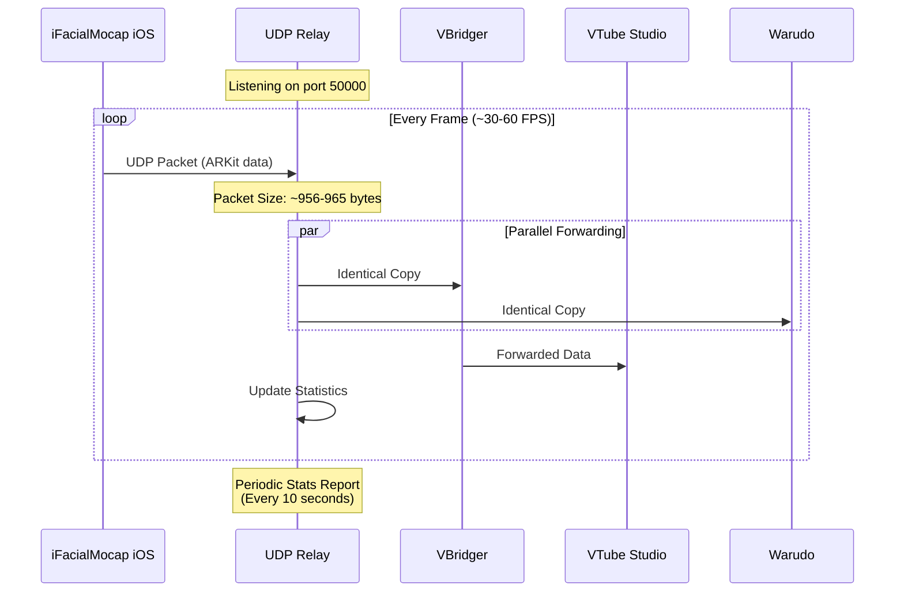

# iFacialMocap UDP Relay

A lightweight Go-based UDP relay that receives ARKit-style facial tracking data from the iFacialMocap iOS app and forwards it simultaneously to multiple destinations (VBridger for VTube Studio, Warudo, etc.) without introducing measurable latency.

## Overview

The relay forwards packets byte-for-byte to all configured targets without modification. This enables splitting iFacialMocap's single UDP stream to multiple applications simultaneously, allowing you to use the same facial tracking data in multiple programs at once.

## Architecture


## Traffic Flow



## Data Format

Based on packet analysis, iFacialMocap sends ARKit-compatible facial tracking data in a pipe-separated string format:

### Packet Structure

- **Packet Size**: ~956-965 bytes
- **Format**: Plain text, pipe-delimited
- **Protocol**: UDP

### Data Components

1. **Blendshape Parameters** (ARKit-compatible)
   - Eye tracking: `eyeSquint_R&10`, `eyeBlink_L&26`, `eyeLookUp_L&0`
   - Mouth tracking: `mouthSmile_R&7`, `mouthPucker&9`, `mouthClose&2`
   - Brow tracking: `browDown_R&10`, `browInnerUp&8`
   - Cheek tracking: `cheekSquint_L&7`, `cheekPuff&4`
   - Jaw tracking: `jawOpen&2`, `jawForward&2`
   - Tracking status: `trackingStatus&1`

2. **Head Rotation** (6-DOF)
   - Format: `head#x,y,z,rx,ry,rz`
   - Example: `head#6.4057,-0.086789705,0.20101094,0.016818939,-0.0029828981,-0.030570496`

3. **Eye Tracking** (3-DOF per eye)
   - Format: `rightEye#x,y,z` and `leftEye#x,y,z`
   - Example: `rightEye#1.4575024,-0.26850903,-0.016194224`

### Example Packet Content

```
trackingStatus&1|eyeSquint_R&10|eyeBlink_L&26|mouthSmile_L&5|...
=head#6.4057,-0.086789705,0.20101094,0.016818939,-0.0029828981,-0.030570496|
rightEye#1.4575024,-0.26850903,-0.016194224|
leftEye#1.4462843,-0.30282283,-0.123135895|
```

## Installation & Build

### Prerequisites

- Go 1.22 or later
  - Windows: `winget install GoLang.Go`
  - macOS: `brew install go`
  - Linux: Use your distribution's package manager

### Build

```bash
# Standard build
go build -ldflags "-s -w" -o ifmrelay.exe main.go

# Smallest binary size
go build -ldflags "-s -w" -trimpath -o ifmrelay.exe main.go

# macOS/Linux
go build -ldflags "-s -w" -o ifmrelay main.go
```

Place `ifmrelay` (or `ifmrelay.exe`) and `relay_config.json` in the same directory.

## Usage

1. **Edit Configuration**
   
   Edit `relay_config.json` to match your setup:
   ```json
   {
     "listen_port": 50000,
     "targets": [
       {"host": "127.0.0.1", "port": 49983, "name": "VBridger"},
       {"host": "127.0.0.1", "port": 39539, "name": "Warudo"}
     ],
     "buffer_size": 4096,
     "log_level": "info",
     "stats_interval": 10
   }
   ```

2. **Start the Relay**
   
   ```bash
   .\ifmrelay.exe -config relay_config.json
   ```

3. **Configure iFacialMocap iOS App**
   - Set your PC's IP address
   - Set port to `50000` (or your configured `listen_port`)
   - **IMPORTANT**: After starting the relay, restart iFacialMocap to establish connection

4. **Verify**
   
   VBridger (which forwards to VTube Studio) and Warudo should receive tracking data simultaneously.

## Verification

When started correctly, you should see:

```
[INFO] Listening on :50000
[INFO] Forwarding to 127.0.0.1:49983 (VBridger)
[INFO] Forwarding to 127.0.0.1:39539 (Warudo)
[INFO] Relay started successfully
```

Every 10 seconds (default), statistics will be printed:

```
[STATS] Uptime: 1m30s | Received: 450 | Forwarded: 900 | Dropped: 0 | Avg Latency: 0.123 ms
```

## Configuration Options

| Option | Type | Default | Description |
|--------|------|---------|-------------|
| `listen_port` | int | 50000 | UDP port to listen for iFacialMocap data |
| `targets` | array | required | List of forwarding destinations |
| `buffer_size` | int | 4096 | Buffer size in bytes for packet handling |
| `log_level` | string | "info" | Logging level: `debug`, `info`, or `error` |
| `stats_interval` | int | 10 | Seconds between statistics reports |

### Target Configuration

Each target requires:
- `host`: IP address or hostname
- `port`: UDP port number
- `name`: Friendly name for logging

## Troubleshooting

### Symptom: No packets arriving or blendshapes not working

**Cause**: iFacialMocap needs to be restarted after relay starts, or wrong port/firewall

**Fix**:
- **RESTART iFacialMocap** after starting the relay (it needs to reconnect)
- Verify iFacialMocap target IP/port matches relay `listen_port`
- Add firewall exception for UDP port 50000 (inbound)
- Check Windows Defender Firewall settings

### Symptom: Only one app updates

**Cause**: One target port is incorrect

**Fix**:
- Verify VBridger/Warudo ports in `relay_config.json` match actual ports
- Check if VBridger and Warudo are listening on expected ports
- Use `netstat -an | findstr :49983` to verify VBridger port

### Symptom: Intermittent lag

**Cause**: System resource constraints or network issues

**Fix**:
- Use wired Ethernet connection (avoid WiFi)
- Check CPU/GPU usage during streaming
- Limit OBS encoder settings if streaming

### Symptom: Dropped packets logged

**Cause**: Network congestion or buffer overflow

**Fix**:
- Use wired Ethernet connection (avoid WiFi)
- Increase `buffer_size` in config if using custom payloads
- Ensure relay has adequate system resources

## Performance Targets

- **CPU usage**: <0.5%
- **Memory usage**: <15 MB
- **Average latency**: <1 ms
- **Packet loss**: <0.1%

## Running as Background Service

### Windows

**Using START /B:**
```cmd
START /B .\ifmrelay.exe -config relay_config.json
```

**As Windows Service (requires NSSM):**
```cmd
nssm install IFMRelay "C:\IFMRelay\ifmrelay.exe" -config "C:\IFMRelay\relay_config.json"
```

### macOS/Linux

**Using nohup:**
```bash
nohup ./ifmrelay -config relay_config.json > relay.log 2>&1 &
```

**As systemd service:**
Create `/etc/systemd/system/ifmrelay.service`:
```ini
[Unit]
Description=iFacialMocap UDP Relay
After=network.target

[Service]
Type=simple
User=yourusername
WorkingDirectory=/path/to/ifmrelay
ExecStart=/path/to/ifmrelay -config relay_config.json
Restart=on-failure

[Install]
WantedBy=multi-user.target
```

Then:
```bash
sudo systemctl enable ifmrelay
sudo systemctl start ifmrelay
```

## Testing

### Basic Test

```bash
# Send a test packet
echo "test" | nc -u 127.0.0.1 50000
```

### Throughput Stress Test

```bash
# Windows PowerShell
1..10000 | ForEach-Object { echo $_ | nc -u 127.0.0.1 50000 }

# Linux/macOS
for i in {1..10000}; do echo $i | nc -u 127.0.0.1 50000; done
```

### Monitor Performance

- **Task Manager** (CPU/Memory)
- **Resource Monitor** (Network activity)
- **Relay statistics** (periodic reports)

## Log Levels

| Level | Description |
|-------|-------------|
| `debug` | Prints every received packet size and timestamp |
| `info` | Standard operation logs + periodic statistics (default) |
| `error` | Only errors and warnings |

## Command Line Options

```
-config <path>    Path to configuration file (default: relay_config.json)
```

## Technical Details

- **Packet Forwarding**: Byte-for-byte, no modification
- **Latency**: Sub-millisecond (typically <1ms)
- **Protocol**: UDP (connectionless, fire-and-forget)
- **Concurrency**: Parallel forwarding to all targets
- **Buffer Size**: Configurable (default 4KB, supports up to 64KB socket buffers)

## Notes

- The relay forwards packets exactly as received (no format conversion)
- VBridger forwards data to VTube Studio (VBridger acts as a bridge between the relay and VTube Studio)
- Warudo receives data directly from the relay
- Each target receives an identical copy of every packet
- No packet transformation or protocol translation occurs

## Version

- **Version**: 2.0 (Simple traffic splitter)
- **Build**: Go 1.21+
- **License**: (Check your project's license file)

## Support

For issues, check:
1. Windows Event Viewer for system errors
2. Relay log output for specific error messages
3. Verify network connectivity between iOS device and PC
4. Ensure target applications are running and listening

## License

[Your License Here]

